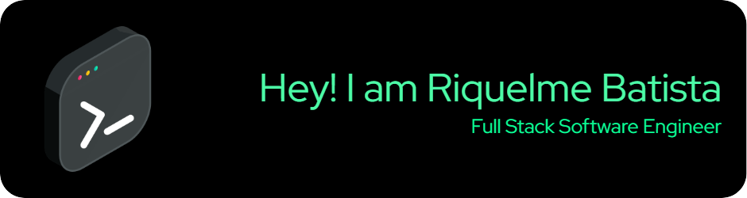

# Hello there! I'm Riquelme Batista 💡

I am an Electrical Technician from [CEFET-MG](https://www.curvelo.cefetmg.br/) and am currently studying computer science at the [University of Jyväskylä](https://www.jyu.fi/en) in Finland as an exchange student. Additionally, I am pursuing a bachelor's degree in Control and Automation Engineering at Universidade Federal de Minas Gerais [(UFMG)](https://www.ufmg.br).
I am focused on enhancing my skills in Software Development, with a particular interest in both front-end and back-end technologies.

### Technologies I'm learning
-  JavaScript, React, MongoDB, and Node.js are some of the technologies I am learning and deepening my studies.
-  Also keen on learning Python, Next.js and Software Testing!!!

###  Let's connect!

### Languages and Technologies

### Frameworks and Libraries

### Tools and Platforms

<picture>
  <source media="(prefers-color-scheme: dark)" srcset="https://raw.githubusercontent.com/mari4souza/mari4souza/output/github-contribution-grid-snake-dark.svg">
  <source media="(prefers-color-scheme: light)" srcset="https://raw.githubusercontent.com/mari4souza/mari4souza/output/github-contribution-grid-snake.svg">
  
</picture>
  

